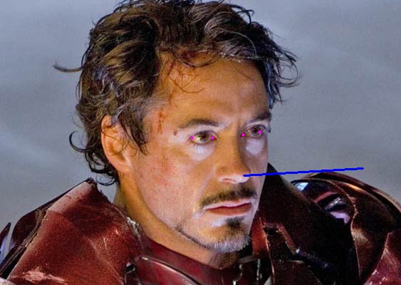

# Gaze Tracking

> "Robot: ≪Are you looking me?≫"

This repo is part of the Computer Vision course final project. The goal of this first part of the pipeline is to detect faces present in the input of the image stream and analyse each of them to learn if the eyes are gazing into the camera. To achieve this result, we studied a process composed of four different steps: face detection, facial landmark detection to get eye corner position, and finally facial pose estimation and finally precise pupil localisation.

## Face detection

To realize the first step, needed not only for the gaze tracking but also for the next parts of the project pipeline, we have studied how to detect faces using one of the many different approaches present in the literature. According to [Zhao et Al, 2003] there are three different models: 1) feature-based, where the goal is to detect distinguished features (like eyes and nose) and compute from their geometrical position if a face is present; 2) template-based, where the input is compared with an already present pattern using an SVM, for instance, and 3) appearance-based, where a small rectangular-shaped patch is overlapped on several windows of the input image. Many different authors have proposed methods based on this approach, with the most cited being the one from [Viola and Jones, 2001].
During our first tests, we used the Haar Cascade classifier that is based on the above-mentioned Viola-Jones. The AdaBoost algorithm is applied over a set of Haar features, the differences between the sum of pixels within adjacent rectangular windows of the image scaled with several factors. We applied the OpenCV library and we tested it detecting faces in Fer2013. We also made the same test using a HOG-based algorithm present in dlib, another C++ library that offers several interesting machine learning and computer vision algorithms. The results of the second method were slightly better as shown in the table.  

|  | No face detected | One face detected | Two faces detected | Time needed to do all the detection |
|---|---|---|---|---|
| Hog Dlib | 10932 | 24955 | 0 | 34.18 s |
| Haar Cascade OpenCv | 15272 | 20608 | 7 | 38.38 s |

_Comparison between two different classical face detection algorithms. They were tested on 35887 images containing a single image. They reach an accuracy of 0,70 and 0,57 respectively. Test made on a 2020 M1 MacBook Air._

Although it may not be the best testing scenario since the faces are often occluded and the test we made not measures important metrics like precision and recall, it has been a very quick way to verify how both methods perform under real life like scenario. We had seen that dlib method handles better occlusions but moreover, is much more rotation invariant then Viola-Jones.

## Facial landmarks detection

For what concern the second step of the process, we get the facial landmarks detection simply using the dlib method. The algorithm is based on a paper from CVPR [Kazemi and Sullivam, 2014] and trained on IBug300-W and it makes use of a cascade ensemble of regression trees to do shape invariant feature selection based on thresholding the diffenrence of intensity values at pixels level. 

The dlib method finds out with a low error 68 landmarks present along the face. From these we only select a few that we have used in the next steps.

![[landmarks.png]]

## Pose estimation

Since the goal of this first part of the pipeline is to detect whether or not a person is facing to the camera, we have to compute the facial pose estimation of the faces detected. We had to solve the so-called Perspective-n-Point (PnP) pose computation problem, computing the rotation and translation $[R|T]$ matrix given the homogeneous coordinates of the face projected on the $[u, v, 1]$ 2d plane, the 3d world face points $p_w$ expressed in world coordinate system and the camera matrix $K$.$$\begin{bmatrix}
  u \\
  v \\
  1
  \end{bmatrix} =
  K \hspace{.3em} \Pi \hspace{.3em}  [R|T]
  \begin{bmatrix}
  X_{w} \\
  Y_{w} \\
  Z_{w} \\
  1
  \end{bmatrix} 
  $$
If expanded, it becomes the following, note that $\Pi$ is the perspective projection model. $$
	\begin{bmatrix}
  u \\
  v \\
  1
  \end{bmatrix} =
  \begin{bmatrix}
  f_x & \gamma & c_x \\
  0 & f_y & c_y \\
  0 & 0 & 1
  \end{bmatrix}
  \begin{bmatrix}
  1 & 0 & 0 & 0 \\
  0 & 1 & 0 & 0 \\
  0 & 0 & 1 & 0
  \end{bmatrix}
  \begin{bmatrix}
  r_{11} & r_{12} & r_{13} & t_x \\
  r_{21} & r_{22} & r_{23} & t_y \\
  r_{31} & r_{32} & r_{33} & t_z \\
  0 & 0 & 0 & 1
  \end{bmatrix}
  \begin{bmatrix}
  X_{w} \\
  Y_{w} \\
  Z_{w} \\
  1
  \end{bmatrix}

$$
While the face points are given from the landmark detection at the previous points, the 3d world point are set using a standard face 3d model. For the best results the 3d points could be measured directly on the target face, but since there is more than a single target, the model is perfectly fitted for a standard human face.

For the camera calibration, we applied the chessboard method implemented in OpenCV, computing the intrinsic camera matrix $K$ starting from several photos of a chessboard. 

To obtain the actual rotation matrix $R$ we used an iterative method  based on a Levenberg-Marquardt optimization present in OpenCV. Then we applied a refinement method also present in the library to get a better prediction. 

Having $R$,  we finally found pitch, roll and yaw of the faces computing the Euler angles from the rotation matrix (get using the Rodrigues formula). 

$$\text{Pitch} = \text{atan2}(r_{32}, r_{33}) , \text{Yaw} = \text{atan2}(-r_{31}, \sqrt{r_{32}^2 + R_{33}^2}) , \text{Roll} = \text{atan2}(r_{21}, r_{11})$$
![[pose.png]]

## Precise eye center localization

As the third step, we have read in detail the method proposed by [Timm and Barth, 2011]. This method lets us get the exact center of the pupil also in images with low resolution and bad lighting. The searched point can be found by comparing the gradient vector $g_i$ at position $x_i$ with the normalized displacement vector of a possible center $d_i$. Preprocessing and postprocessing are done to obtain optimal results.

$$  c^*=\underset{c}{\arg\min} \frac{1}{N} \sum_{i=1}^{N}(d_i^\top g_i)^2 , $$ 

$$ d_i = \frac{x_i-c}{||x_i-c||_2}, \forall{i}: ||g_i||_2=1 $$

This method requires an input of a cropped image of an eye, so we used the information from the second step to get the needed processing. We then developed a script of the above-presented method, partially following an already existing work [Trishume].

At this point, having both the eye corners and the pupil center we can compute the final step.  

 
*Figure 1. Eye corners have been detected and marked in pink, the cropped regions where to find each eye center are contoured in yellow, and, finally, detected pupils positions is the green dot. Please note that the left eye has not been perfectly computed since
it is partially occluded*

## Testing
Time for computing means of gradients for pupil detection: 169.99545860290527
Time for computing filtering for pupil detection: 42.86112999916077

MEANS_OF_GRADIENTS
Removed outliers: 3
Mean: 3.003892424456261
Std Dev: 2.2201800540169616
FILTERING
Removed outliers: 3
Mean: 3.198455476190354
Std Dev: 1.1560352421915776

# References

- Timm, F., & Barth, E. (2011). Accurate eye centre localisation by means of gradients. Visapp, 11, 125-130
- Vahid Kazemi, Josephine Sullivan; Proceedings of the IEEE Conference on Computer Vision and Pattern Recognition (CVPR), 2014, pp. 1867-1874
- Viola, P., & Jones, M. J. (2004). Robust real-time face detection. International journal of computer vision, 57, 137-154.
- abhisuri97. (n.d.). Abhisuri97/pyeLike: Basic pupil tracking with gradients in Python (based on Fabian Timm's algorithm). GitHub. Retrieved May 1, 2023, from https://github.com/abhisuri97/pyeLike 
- Trishume. (n.d.). Trishume/eyeLike: A webcam based pupil tracking implementation. GitHub. Retrieved May 1, 2023, from https://github.com/trishume/eyeLike 
- Zhao, W., Chellappa, R., & Phillips, P. J. (2003). A. Rosenfeld. Face recognition: a literature survey. ACM Computing Surveys, 35(4), 399-458.
- https://www.bioid.com/uploads/AVBPA01BioID.pdf
- IBUG 300-W Dataset